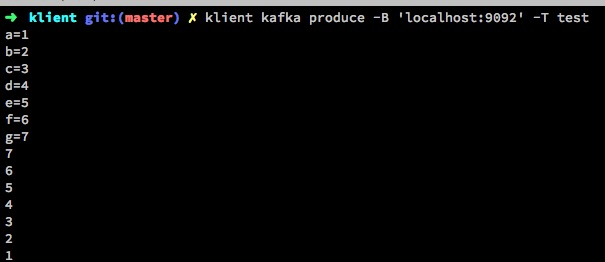
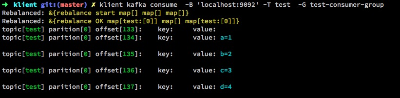
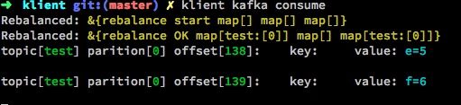
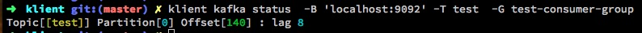
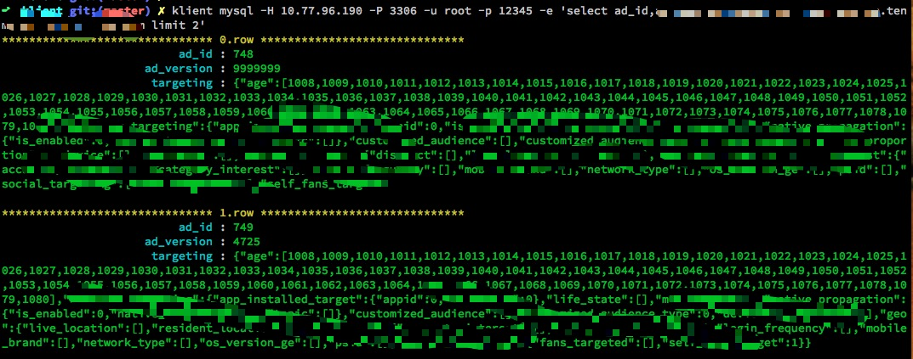

# Klient 

## Features

Klient can be used as a terminal client with colorful output for several databases .   

1. Colorful output
2. Simple command: Resue [FORMULA...] which can be stored in $USER_HOMEDIR/.klient.toml
3. More databases
    * kafka
    * mysql | pgsql
    * postgresql
    * clickhouse
    * redis
  
--- 

## Installation

### linux

    $ sudo wget -O /usr/bin/klient https://github.com/lubit/klient/releases/download/0.0.1/klient.linux.amd64

### macos

    $ sudo wget -O /usr/bin/klient https://github.com/lubit/klient/releases/download/0.0.1/klient.mac

---

## Usage

    $ klient [driver] [commands] [FORMULA...]

### Exmaple 

    $ klient kafka produce -B 'localhost:9092' -T test

    $ klient kafka consume  -B 'localhost:9092' -T test  -G test-consumer-group

### TIPS 
Omit [FORMULA...] parameters which were stored in  $USER_HOMEDIR/.klient.toml

    $ klient kafka consume

    $ klient kafka status  -B 'localhost:9092' -T test  -G test-consumer-group

    $ klient mysql -H localhost -P 3306 -u root -p 12345 -e 'select *  from user'

---
## Reference Driver

#### kafka: [github.com/Shopify/sarama](github.com/Shopify/sarama) && [github.com/bsm/sarama-cluster](github.com/bsm/sarama-cluster)
#### mysql: [github.com/go-sql-driver/mysql](github.com/go-sql-driver/mysql)
#### postgresql: [github.com/lib/pq](github.com/lib/pq)
#### clickhouse: [github.com/kshvakov/clickhouse](github.com/kshvakov/clickhouse)
#### redis: [github.com/garyburd/redigo/redis](github.com/garyburd/redigo/redis)

---
## Authors
* [@罗发宣](https://weibo.com/u/6028984452)
